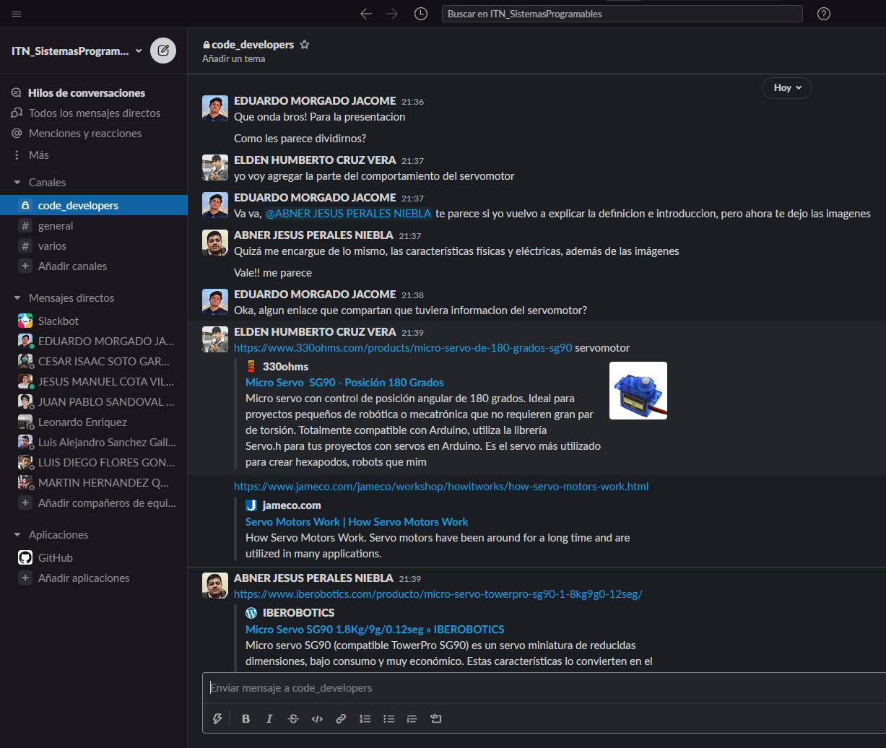
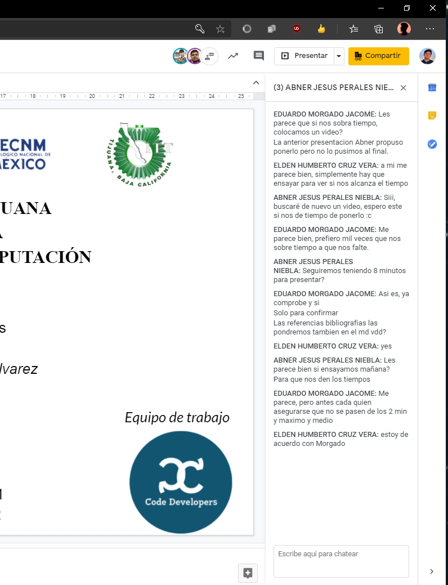
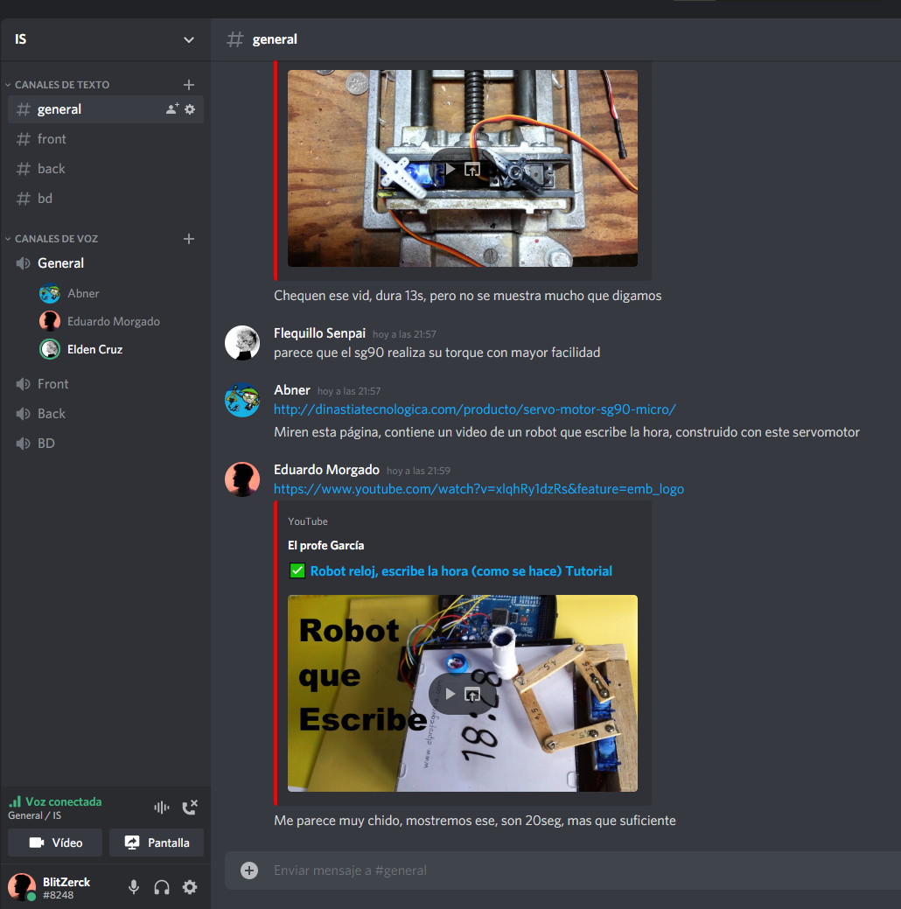

# Actuadores

## :trophy: A.2.1 Actividad de aprendizaje

**Tipos de actuadores eléctricos comerciales**

### :blue_book: Instrucciones

1. Cada equipo deberá elaborar su presentación de acuerdo con el modelo del actuador eléctrico que el asesor le indique.
2. Los temas deberán exponerse en clase por todos los integrantes evitando que se perciba la lectura del documento.
3. El tiempo máximo de la presentación deberá ser no mayor a 8 minutos.
4. La actividad será redactada utilizando el estilo ***markdown***.
5. El documento deberá incluir, los elementos indicados en la **rubrica** tales como son portada, introducción, desarrollo, conclusiones e información bibliográfica o enlaces utilizados.
6. El desarrollo deberá incluir características físicas y eléctricas, esquemático, usos aplicativos,  imágenes del actuador, asi como cualquier otra información que considere importante y que le pueda apoyar en el desarrollo de la exposición.
7. El documento deberá contar con la nomenclatura **A2.1_NombreApellido_Equipo**, y se deberá subir a la plataforma classroom en formato PDF dentro del apartado correspondiente a la actividad.
8. El documento elaborado para desarrollar la actividad será compartido en la plataforma colaborativa **GitHub**, dando acceso al asesor para su revisión.

### :pencil2: Desarrollo

1. Utilice el siguiente listado de modelos de actuadores electricos comerciales, para elaborar su actividad de acuerdo con las instrucciones solicitadas por el asesor.

   - [ ] [Motor reductor de doble eje](https://articulo.mercadolibre.com.mx/MLM-651722486-motor-reductor-de-doble-eje-recto-3-vcc-mot-120-_JM?quantity=1#position=3&type=item&tracking_id=36396cb4-7b75-41a3-97e3-a0c6af6709c3) 
   - [ ] [Motor Unipolar paso a paso](https://articulo.mercadolibre.com.mx/MLM-587352935-motor-a-pasos-pm55l-048-unipolar-75-por-paso-con-cables-_JM?quantity=1#position=3&type=item&tracking_id=1a7ba1b9-b483-4d15-889f-2b970c4779c2) 
   - [ ] [Motor Bipolar paso a paso](https://articulo.mercadolibre.com.mx/MLM-783827003-motores-a-pasos-nema-23-bipolar-13kg-minebea-japones-arduino-_JM?quantity=1#position=2&type=item&tracking_id=f05c36d1-e3e0-4d19-b76e-8bbd132124fd) 
   - [x] [Servomotor modelo SG90](https://articulo.mercadolibre.com.mx/MLM-618694358-micro-servomotor-sg90-robotica-arduino-16-kg-servo-motor-_JM?quantity=1&variation=23651072471#position=1&type=item&tracking_id=4b156b79-3721-4fc1-9ef0-4f378d92e1ef)

2. Espere a que el asesor le indique que tipo de sensor sera el que desarrollara su equipo y una vez que tenga marque el sensor dentro del punto anterior.
3. Una vez que conoce el tema a desarrollar, investigue y redacte dentro de este documento los puntos siguiente:

   - **Portada**, información del alumno, asesor, carrera, materia, fecha,..
   - **Introduccion**, una breve descripción de que tratara el tema.
   - **Desarrollo**
     - **Definición**.
     - **Imágenes** del actuador.
     - Características **físicas**.
     - Características **eléctricas**.
     - Explique cual el principio de funcionamiento.
     - Usos aplicativos.
     - Se puede apoyarse de un video que no debe durar mas de 1/3 del tiempo de su presentación..
    - **Conclusiones** por cada uno de los integrantes del equipo.
    - **Bibliográfia**, agregue dentro de este apartado toda bibliografia en la cual se apoyo para el desarrollo de la actividad, utilizando etiquetas y los enlaces.

   #### :page_facing_up: [Enlace directo a la presentacion.](https://github.com/AbnerPerales19/SistemasProgramables_AbnerPerales/blob/master/pdfs/A2.1_Presentacion.pdf) :page_facing_up:

   ##### :page_facing_up: Bibliografía: 
   [Definicion de un servomotor](https://www.cursosaula21.com/que-es-un-servomotor/)  
   [¿Que es PWM?](https://www.rinconingenieril.es/que-es-pwm-y-para-que-sirve/)  
   [Definicion del servomotor SG90](https://www.geekfactory.mx/tienda/motores-y-controladores/sg90-micro-servo-motor/)  
   [Descripción del servomotor SG90](https://www.iberobotics.com/producto/micro-servo-towerpro-sg90-1-8kg9g0-12seg/)  
   [Características del Servo SG90](https://www.youtube.com/watch?v=YsKKtlLd68o)  
   [¿Qué es un torque?](https://www.dercocenter.cl/noticias/que-es-el-torque-en-un-auto/)  
   [Aplicaciones del servomotor](https://www.330ohms.com/products/micro-servo-de-180-grados-sg90)  
   [Comportamiento/funcionamiento del servomotor](https://www.jameco.com/jameco/workshop/howitworks/how-servo-motors-work.html)  

5. Inserte imágenes de **evidencias** tales como son reuniones  de los integrantes del equipo realizadas para el desarrollo de la actividad.

6. Incluya las conclusiones individuales y resultados observados durante el desarrollo de la actividad.

- *Morgado Jacome Eduardo*

    > Durante la realización de la actividad entendí el funcionamiento de un servomotor, los cuales ya he utilizado en proyectos escolares pero desconocía el correcto funcionamiento de PWM, el cual controla el ángulo de un servomotor. De igual manera al investigar el funcionamiento de un servomotor aprendí que su principio se aplica a muchos más componentes electrónicos, como por ejemplo en un LED para regular la intensidad de brillo, o para controlar la velocidad de un motor de corriente continua.

- *Perales Niebla Abner Jesus*

    > Mientras investigaba las características del servomotor me topé con un video donde realizaban un robot reloj (escribe la hora), esto lo realizó gracias a 3 servomotores, esto la verdad me gustó mucho, pues siempre he creído que para realizar cosas sencillas (con más razón cosas no sencillas), se necesita mucha elaboración, muchos componentes y mucha práctica. Y este video me desmintió eso, pues también incluye un pequeño tutorial de como hacer tu propio robot reloj. Ahora, cuando vea algún proyecto de este tipo, intentaré ver los componentes que utiliza para intentar comprender cómo funciona, en lugar de cerrarme al pensar que está muy difícil.

- *Cruz Vera Elden Humberto*

    > Algo que pude notar al realizar la actividad y que me pareció bastante interesante, es que como puede variar el precio entre distintos modelos de servomotores ya que cada uno tiene características específicas que lo hacen distinto. Por lo cual es de gran importancia saber con qué tipo de servomotor se está trabajando y para que será utilizado. Y con la información recabada dentro del documento se puede apreciar que este servomotor es de gran utilidad en proyectos de robótica. 

---

### :bomb: Rubrica

| Criterios     | Descripción                                                                                  | Puntaje |
| ------------- | -------------------------------------------------------------------------------------------- | ------- |
| Instrucciones | Se cumple con cada uno de los puntos indicados dentro del apartado Instrucciones?            | 10      |  | 5 |
| Desarrollo    | Se respondió a cada uno de los puntos solicitados dentro del desarrollo de la actividad?     | 60      |
| Demostración  | El alumno se presenta durante la explicación de la funcionalidad de la actividad?            | 20      |
| Conclusiones  | Se incluye una opinión personal de la actividad  por cada uno de los integrantes del equipo? | 10      |

:house: [Ir a inicio](../readme.md)

##### :open_file_folder: [Repositorio de Github de Morgado Jacome Eduardo](https://github.com/EduardoMJ99/SistemasProgramables_2020-2.git) :open_file_folder:
##### :open_file_folder: [Repositorio de Github de Cruz Vera Elden Humberto](https://github.com/CruzVeraEldenHumberto/Sistemas-Programables) :open_file_folder:
##### :open_file_folder: [Repositorio de Github de Perales Niebla Abner Jesús](https://github.com/AbnerPerales19/SistemasProgramables_AbnerPerales.git) :open_file_folder: