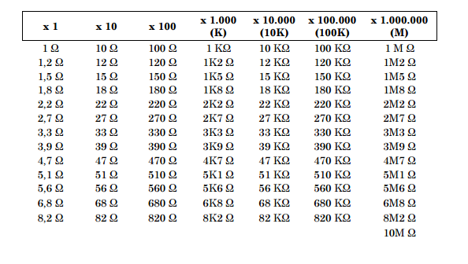

# Sensores
## :trophy: C1.4 Reto en clase

Circuito electrónico para el acondicionamiento de señal con un amplificador operacional

### :blue_book: Instrucciones

___

- De acuerdo con la información presentada por el asesor referente al tema acondicionadores de señal, contestar lo que se indica dentro del apartado desarrollo.

- Toda actividad o reto se deberá realizar utilizando el estilo **MarkDown con extension .md** y el entorno de desarrollo VSCode, debiendo ser elaborado como un documento **single page**, es decir si el documento cuanta con imágenes, enlaces o cualquier documento externo debe ser accedido desde etiquetas y enlaces.
- Es requisito que el archivo .md contenga una etiqueta del enlace al repositorio de su documento en Github, por ejemplo **Enlace a mi GitHub**
- Al concluir el reto el reto se deberá subir a github el archivo .md creado.
- Desde el archivo **.md** se debe exportar un archivo **.pdf** con la nomenclatura **C1.4_NombreAlumno_Equipo.pdf**, el cual deberá subirse a classroom dentro de su apartado correspondiente, para que sirva como evidencia de su entrega; siendo esta plataforma **oficial** aquí se recibirá la calificación de su actividad por individual.
- Considerando que el archivo .pdf, fue obtenido desde archivo .md, ambos deben ser idénticos y mostrar el mismo contenido.
- Su repositorio ademas de que debe contar con un archivo **readme**.md dentro de su directorio raíz, con la información como datos del estudiante, equipo de trabajo, materia, carrera, datos del asesor, e incluso logotipo o imágenes, debe tener un apartado de contenidos o indice, los cuales realmente son ligas o **enlaces a sus documentos .md**, _evite utilizar texto_ para indicar enlaces internos o externo.
- Se propone una estructura tal como esta indicada abajo, sin embargo puede utilizarse cualquier otra que le apoye para organizar su repositorio.

```  
| readme.md
| | blog
| | | C0.1_x.md
| | | C0.2_x.md
| | | C0.3_x.md
| | img
| | docs
| | | A0.1_x.md
| | | A0.2_x.md
```


## :pencil2: Desarrollo

___

**Problema a resolver:**

1. Calcular el valor de R1 y R2 que se requiere, para obtener una voltaje de salida de 3.3v, dado que el Voltaje de entrada es de 2.5v? Explique el procedimiento utilizado para realizar el calculo y considere valores comerciales para las resistencias que se considere utilizar

**R1 = 470 ohms** 

**R2 = 150 ohms**

> Como el ejercicio especifica que necesitamos un voltaje de salida de 3.3v, debemos crear el caso donde esto sea cierto y ver el comportamiento de las resistencias, por lo que V_salida = 3.3v
>    
> Tenemos la fórmula V_salida = V_entrada (1 + R2/R1)
> 
> Y tenemos los valores dados por el problema: V_salida = 3.3v, V_entrada = 2.5v
> 
> Por lo que debemos sustituir en la fórmula:
> 
> 3.3v = 2.5v(1 + R2/R1) 
> 
> 3.3v/2.5v = 1 + R2/R1
> 
> 1.32 = 1 + R2/R1
> 
> 1.32 - 1 = R2/R1
> 
> 0.32 = R2/R1
> 0.32 x R1 = R2
> 
> Entonces, lo siguiente que realicé aquí fue multiplicar 0.32 x un valor de una resistencia comercial. El valor que resulte tendría que estar también en la tabla de resistencias comerciales.
> 
> Para este ejercicio, tomé los valores de resistencias comerciales de una tabla encontrada en internet que anexo al final de este punto.
> 
> 0.32 * R1 = R2, 0.32 * 470 ohms = 150.4 ohms, y en la tabla podemos ver que existen resistencias de 150 ohms, sin embargo, las resistencias tienen, por lo regular, una tolerancia de 10% o 5%. Por lo que la resistencia de 150 ohms puede tener en realidad entre 142.5 ohms y 157.5 ohms tomando una tolerancia del 5%
> 
> Entonces, **R1 = 470 ohms, R2 = 150 ohms**, ¿Por qué estas resistencias y no 4.7k ohms y 1.5k ohms respectivamente, si también son aplicables?, de hecho tenemos 7 posibles combinaciones. Sin embargo, no elegí combinacios más pequeñas por la convención de utilizar este tamaño de resistencias, y no utilicé más grande, pues el % de tolerancia (la diferencia de resistencia) sería mucho mayor y hay más rango de fallo.


**Tabla de resistencias comerciales**

___

### :bomb: Rubrica

| Criterios     | Descripción                                                                                  | Puntaje |
| ------------- | -------------------------------------------------------------------------------------------- | ------- |
| Instrucciones | Se cumple con cada uno de los puntos indicados dentro del apartado Instrucciones?            | 20 |
| Desarrollo    | Se respondió a cada uno de los puntos solicitados dentro del desarrollo de la actividad?     | 80      |

:house: [Ir a readme](https://github.com/AbnerPerales19/SistemasProgramables_AbnerPerales.git)

:page_with_curl: [Ver en repositorio](https://github.com/AbnerPerales19/SistemasProgramables_AbnerPerales/blob/master/blog/C1.4_Acondicionador_de_senal_AmOP.md)

**Elaborado por Abner Jesús Perales Niebla**