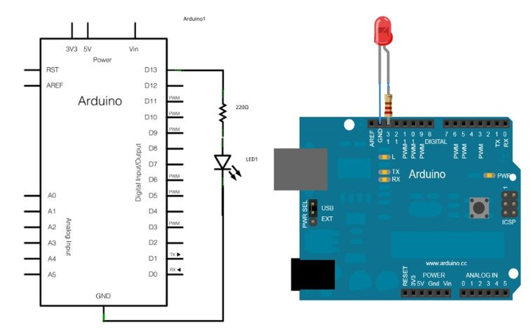
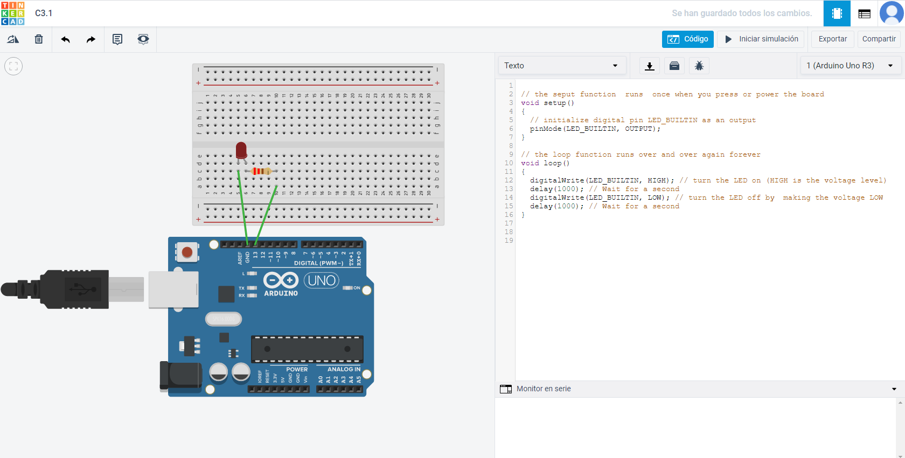
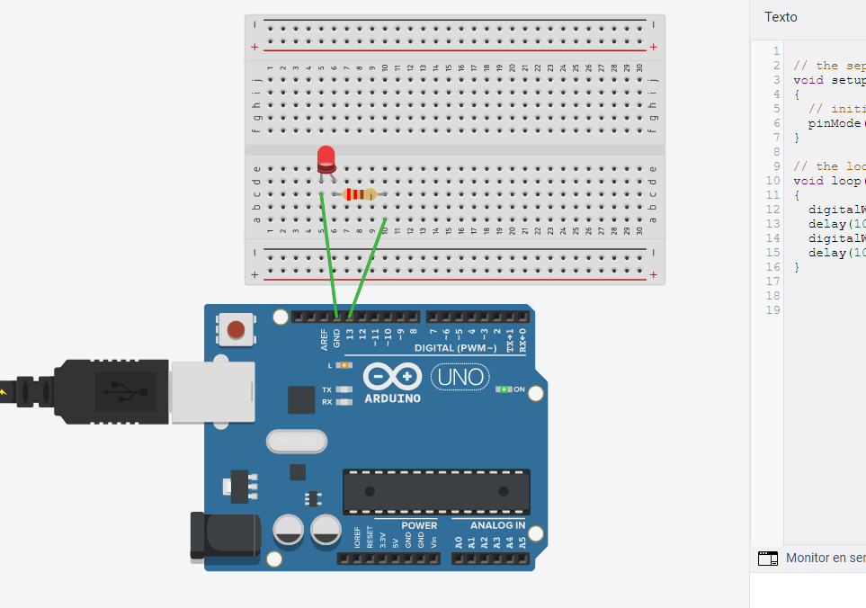

# Programación Microcontrolador Arduino

## :trophy: C3.1 Arduino UNO salida digital

Arduino IDE y Arduino UNO, utilizando un diodo LED y una resistencia

### :blue_book: Instrucciones

- De acuerdo con la información presentada por el asesor referente al tema, desarrollar lo que se indica dentro del apartado desarrollo.
- Toda actividad o reto se deberá realizar utilizando el estilo **MarkDown con extension .md** y el entorno de desarrollo VSCode, debiendo ser elaborado como un documento **single page**, es decir si el documento cuanta con imágenes, enlaces o cualquier documento externo debe ser accedido desde etiquetas y enlaces.
- Es requisito que el archivo .md contenga una etiqueta del enlace al repositorio de su documento en Github, por ejemplo **Enlace a mi GitHub**
- Al concluir el reto el reto se deberá subir a github el archivo .md creado.
- Desde el archivo **.md** se debe exportar un archivo **.pdf** con la nomenclatura **C3.1_NombreAlumno_Equipo.pdf**, el cual deberá subirse a classroom dentro de su apartado correspondiente, para que sirva como evidencia de su entrega; siendo esta plataforma **oficial** aquí se recibirá la calificación de su actividad por individual.
- Considerando que el archivo .pdf, fue obtenido desde archivo .md, ambos deben ser idénticos y mostrar el mismo contenido.
- Su repositorio ademas de que debe contar con un archivo **readme**.md dentro de su directorio raíz, con la información como datos del estudiante, equipo de trabajo, materia, carrera, datos del asesor, e incluso logotipo o imágenes, debe tener un apartado de contenidos o indice, los cuales realmente son ligas o **enlaces a sus documentos .md**, _evite utilizar texto_ para indicar enlaces internos o externo.
- Se propone una estructura tal como esta indicada abajo, sin embargo puede utilizarse cualquier otra que le apoye para organizar su repositorio.  

``` 
| readme.md
| | blog
| | | C3.1_TituloActividad.md
| | | C3.2_TituloActividad.md
| | | C3.3_TituloActividad.md
| | img
| | docs
| | | A3.1_TituloActividad.md
| | | A3.2_TituloActividad.md
```

## :pencil2: Desarrollo

1. Basado en el siguiente circuito, y utilizando uno de los simuladores propuestos, ensamblar lo que observa.

<p align="center">
    
</p>

2. Analice y escriba el programa que se muestra a continuación.

<p align="center">
    
</p>

3. Explique el resultado observado.
   > Primero asignamos como salida al pin LED_BUILTIN (es el número del pin al que el led está conectado, en la amyoría de las ocasiones y en este caso, es el pint 13). Luego se realiza un blucle infinito, en el cual incluimos lo siguiente. <br><br> Primero se le asigna al pin el valor de **HIGH** con el **digitalWrite**, lo que, como el pin está configurado como salida, hace que le llegue voltaje, por lo que se enciende el led, esto sigue así durante el **delay** que en este caso es de 1 segundo. <br><br> Luego de ese segundo de espera, le cambia el valor a **LOW** con el digitalWrite y le pasa 0V al led, por lo que se apagará, luego espera 1 segundo con el **delay** y vuelve a iniciar el ciclo. <br><br> Lo que vemos como resultado es un led que primero se encience un segundo, luego queda apagado por otro segundo, y sigue el mismo proceso una y otra vez.

4. Inserte aquí las imágenes que considere como evidencias para demostrar el resultado obtenido.

<p align="center">
    
</p>
<p align="center">
    
</p>
### :bomb: Rubrica

| Criterios     | Descripción                                                                                  | Puntaje |
| ------------- | -------------------------------------------------------------------------------------------- | ------- |
| Instrucciones | Se cumple con cada uno de los puntos indicados dentro del apartado Instrucciones?            | 20 |
| Desarrollo    | Se respondió a cada uno de los puntos solicitados dentro del desarrollo de la actividad?     | 80      |

:house: [Ir a readme](https://github.com/AbnerPerales19/SistemasProgramables_AbnerPerales.git)

:page_with_curl: [Ver en repositorio](https://github.com/AbnerPerales19/SistemasProgramables_AbnerPerales/blob/master/blog/C3.1_ArduinoIDE_SalidaDigital.md)