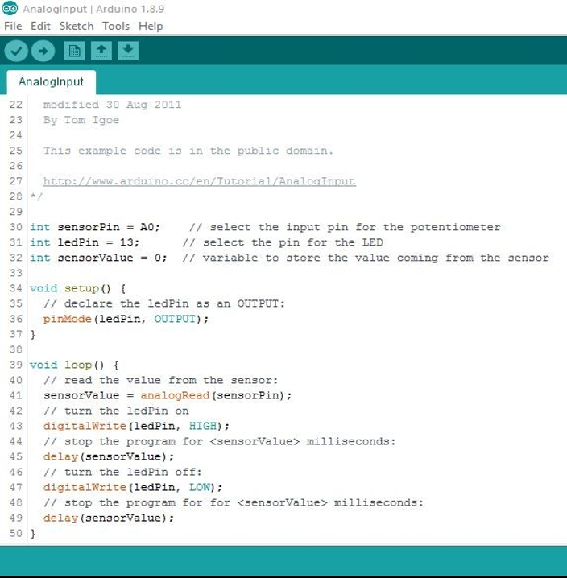

# Programación Microcontrolador Arduino

## :trophy: C3.4 Entradas analógica y salida digital

Arduino, entrada análoga, salida digital y uso de función serial a través de un potenciómetro, una resistencia y un sensor LDR.

## :blue_book: Instrucciones

- De acuerdo con la información presentada por el asesor referente al tema, desarrollar lo que se indica dentro del apartado siguiente.
- Toda actividad o reto se deberá realizar utilizando el estilo **MarkDown con extension .md** y el entorno de desarrollo VSCode, debiendo ser elaborado como un documento **single page**, es decir si el documento cuanta con imágenes, enlaces o cualquier documento externo debe ser accedido desde etiquetas y enlaces.
- Es requisito que el archivo .md contenga una etiqueta del enlace al repositorio de su documento en Github, por ejemplo **Enlace a mi GitHub**
- Al concluir el reto el reto se deberá subir a github el archivo .md creado.
- Desde el archivo **.md** se debe exportar un archivo **.pdf** con la nomenclatura **C2.3_NombreAlumno_Equipo.pdf**, el cual deberá subirse a classroom dentro de su apartado correspondiente, para que sirva como evidencia de su entrega; siendo esta plataforma **oficial** aquí se recibirá la calificación de su actividad por individual.
- Considerando que el archivo .pdf, fue obtenido desde archivo .md, ambos deben ser idénticos y mostrar el mismo contenido.
- Su repositorio ademas de que debe contar con un archivo **readme**.md dentro de su directorio raíz, con la información como datos del estudiante, equipo de trabajo, materia, carrera, datos del asesor, e incluso logotipo o imágenes, debe tener un apartado de contenidos o indice, los cuales realmente son ligas o **enlaces a sus documentos .md**, _evite utilizar texto_ para indicar enlaces internos o externo.
- Se propone una estructura tal como esta indicada abajo, sin embargo puede utilizarse cualquier otra que le apoye para organizar su repositorio.  

``` 
| readme.md
| | blog
| | | C3.1_TituloActividad.md
| | | C3.2_TituloActividad.md
| | | C3.3_TituloActividad.md
| | | C3.4_TituloActividad.md
| | img
| | docs
| | | A3.1_TituloActividad.md
| | | A3.2_TituloActividad.md
```

## :pencil2: Desarrollo

1. Basado en el siguiente circuito, y utilizando uno de los simuladores propuestos, ensamblar lo que observa.

<p align="center">
    
</p>

2. Analice y escriba el programa que se muestra a continuación.

<p align="center">
     
</p>

3. Explique el resultado observado.
   > En primer lugar, modifiqué el valor de **ledPin** a 9, pues es en el pin 9 donde está conectado el led. Ahora, ¿Qué es lo que sucede? primero, estamos declarando que el pin 9 sea la salida (la cual está conectada con el led) y el pin A0 sea la entrada analógica. Entonces, cuando variamos el potenciómetro y le ponemos mucha resistenacia, ya no pasa voltaje a la entrada A0, por tanto **sensorValue** vale 0, lo que provoca que el **delay** sea de 0 milisegundos, y el bucle esté pasando y cortando el voltaje hacia el pin, lo que provoca que se encienda y apague en cuestión de milisegundos, lo que es imperceptible para nosotros, así vemos como si siempre estuviera encendido. De lo contrario, cuando el valor de la resistencia del potenciometro es poca o nula, provoca que se pase mucho voltaje al pin A0, lo que significa que **sensorValue** si tendrá un valor diferente y mayor a 0, por lo que los **delay**,después de subir y bajar la corriente que se dirige hacia el led, sean entre 1 y 1023 milisegundos, tiempo que el led se mantendrá encendido y luego apagado, una y otra vez.

4. Inserte aquí las imágenes que considere como evidencias para demostrar el resultado obtenido.

<p align="center">
     
</p>
<p align="center">
     
</p>
<p align="center">
     
</p>

### :bomb: Rubrica

| Criterios     | Descripción                                                                                  | Puntaje |
| ------------- | -------------------------------------------------------------------------------------------- | ------- |
| Instrucciones | Se cumple con cada uno de los puntos indicados dentro del apartado Instrucciones?            | 20 |
| Desarrollo    | Se respondió a cada uno de los puntos solicitados dentro del desarrollo de la actividad?     | 80      |

:house: [Ir a readme](https://github.com/AbnerPerales19/SistemasProgramables_AbnerPerales.git)

:page_with_curl: [Ver en repositorio](https://github.com/AbnerPerales19/SistemasProgramables_AbnerPerales/blob/master/blog/C3.4_ArduinoIDE_EntradaSalidaSensorFuncionSerial.md)