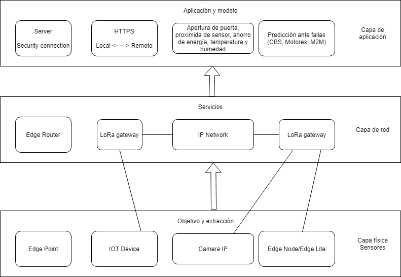

## :trophy: C0.2 Reto en clase

**Conceptos de Industria 4.0 e IOT**

### :blue_book: Instrucciones

- De acuerdo con la información presentada y el video mostrado por el asesor, contestar las preguntas indicadas en la tabla del apartado desarrollo.
- Al concluir el reto se deberá subir en formato PDF a la plataforma con la nomenclatura **C0.2_NombreApellido_Equipo.pdf.**
- Se deberá publicar el reto dentro del repositorio Git personal de cada estudiante, utilizando el estilo MarkDown y el entorno de desarrollo VSCode.
- Es recomendable crear el repositorio siguiente una estructura tal como:
```
- readme.md
  - blog
    - C0.1_x.md
    - C0.2_x.md
  - img
  - docs
    - A0.1_x.md
    - A0.2_x.md
```
  
### :pencil2: Desarrollo

1. Responde a las siguientes preguntas:

| Numero | Pregunta                                            | Respuesta  |
| ------ | --------------------------------------------------- | ---------  |
| 1.1      | A que esta referido el termino Industria conectada? |      Al hecho de que se introduzcan sistemas físicos cibernéticos, que trabajen en conjunto para un mejor análisis, en lugar de tener que deducir o "adivinar" lo que está ocurriendo      |
| 1.2      | ¿Qué es un sistema en tiempo real?                  |     Es aquel sistema que te ofrece análisis, y en ocaciones, resultados inmediatamente después de su interacción con él.      |
| 1.3      | Mencione que tecnologías envuelven el concepto Industria 4.0    |     Algunas son: Big data, Computación en la nube, Inteligencia artificial, Cyber seguridad, Realidad virtual y aumentada, Robótica colaborativa, Impresión 3D e Internet de las cosas.       |
| 1.4      | Referente al tema automatización industria, en que consiste el nivel de campo?                        |       Consiste en todos aquellos elementos físicos (tangibles) que se pueden utilizar en la industria, como los sensores.     |
| 1.5      | Elabore un diagrama de capas que muestre la arquitectura de un ecosistema tecnológico para IOT?                       |            |
| 1.6      | Que es un sistema de control embebido?         |      Es el sistema encargado de controlar el hardware; monitorea, inicia y detiene el proceso que se necesita realizar (nosotros interactuamos con dicho sistema, que a su vez traduce nuestras peticiones a los dispositivos)      |
| 1.7      | Que tecnologías observa en el video referentes al concepto Industria 4.0?         |  Robótica colaborativa (por la capacidad de los robots de colaborar con los humanos), Inteligencia artificial y Big data (su capacidad de tomar decisiones y saltar obstáculos), Simulación (La forma en que decide cuál es la mejor ruta de transporte) e Integración horizontal y vertical (LA forma de reprogramar las actividades del robot y su capacidad de moverse entre los pisos de la empresa).           |
| 1.8      | Basado en el video que ha ofrecido la robótica en la industria?        |     Ah ayudado a aumentar la productividad y la rentabilidad, así como optimizar el flujo de trabajo de la empresa.       |

2. Instale la extension [Draw.io integration](https://marketplace.visualstudio.com/items?itemName=hediet.vscode-drawio) dentro de visual studio code y elabore el diagrama solicitado siguiendo las instrucciones para esta actividad.

    :arrow_forward: [Extension de visual studio code - Draw.io integration](https://www.youtube.com/watch?v=Y47ZlxoDWNI)

3. Coloque el diagrama que se solicita dentro del punto 1.5 en este apartado.
   -Ejemplo de un diagrama de flujo utilizando draw.io



:house: [Ir a inicio](../README.md)

[Repositorio de Abner Perales](https://github.com/AbnerPerales19/SistemasProgramables_AbnerPerales.git)